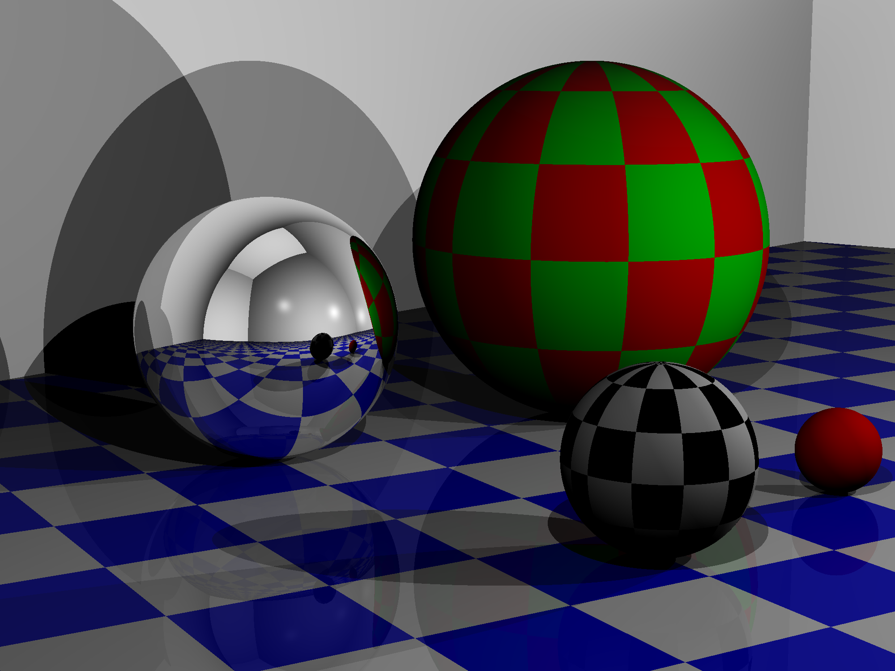
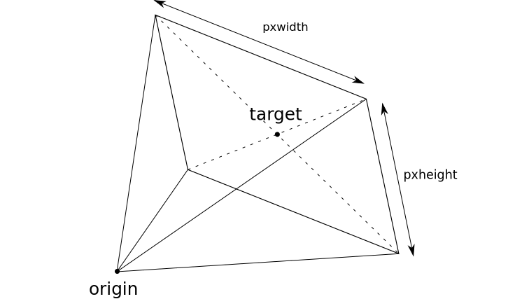
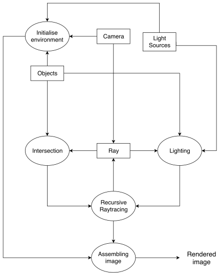

#Projet IN204 - Lancer de rayons

####Par Marie Kalouguine et Davy Simeu



##Description du projet

Ce projet qui a été mené sur plusieurs mois consistait à implémenter en C++ un algorithme de lancer de rayons fiable et efficace pour synthétiser des "photos" d'objets tridimensionnels. La donnée des objectifs se décline comme suit :

* Fournir une bibliothèque d’objets permettant de décrire les éléments composant une scène.
 
* Fournir une bibliothèque d’objets permettant d’implanter différents moteurs implantant le rendu d’image par lancer de rayons.

* Et pour tester l’intégration de ces fonctions, un environnement permettant de spécifier les scènes, de lancer l’exécution des moteurs et d’afficher le résultat.
Il s'agit de réaliser un code de calcul de lancer de rayons.

Ces objectifs ont été atteints au cours du projet, et l'image affichée en tête de ce fichier a été réalisée avec le code que nous avons écrit.

##Utilisation du code pour synthétiser des images
####Consignes utilisateur

Le projet a été réalisé sous une distribution Linux et pour Linux, il est donc recommandé d'en être équipé pour tester le code. La compilation nécessite un compilateur C++11.

Pour compiler le projet, il suffit d'entrer la commande `make` dans la ligne de commande.
Cela crée un fichier exécutable `raytracing`, qui permet d'analyser le fichier de description de scènes `scene.xml`(se trouvant dans le même répertoire), et synthétiser une image correspondante par lancer de rayons.

Pour tester le programme, modifiez le fichier XML à vos besoins, puis lancez la commande `./raytracing`

####Description de scènes avec XML
La description d'une scène se fait à l'aide de balises dans le fichier `scene.xml`, dans un langagé basé sur XML. La scène s'apparente ainsi à une structure d'arbre. La lecture du fichier se fait grâce à la bibliothèque tinyXML2, donc le code source a été inclus dans le dossier src.

À la racine de l'arbre se trouve la balise <world\>, dans laquelle on place les différents objets composant la scène. Parmi eux, il y a la balise caméra <camera\>, l'ensemble des éclairages <lights\>, ainsi que l'ensemble des objets à représenter <shapes\>.

Une caméra <camera\> est définie par le point duquel on regarde (origin), ainsi qu'un autre point indiquant la direction. Ce deuxième point est dans le plan de projection de la caméra, et l'angle de vue est déterminé par la taille de l'image finale en pixels (pxwidth et pxheight) ainsi que la largeur "réelle" du plan de projection (width). Sa hauteur n'est pas renseignée mais calculée automatiquement, afin d'éviter d'étirer l'image par inadvertence. La modification de pxwidth et pxheight infue autant sur l'angle vertical que sur la résolution de l'image (et donc la longueur de l'execution).

> La rotation de la caméra autour de cet axe est négligée, on considère que le bord bas du plan de projection est toujours horizontal.

**Représentation mathématique d'une caméra :**



À l'intérieur de la balise <lights\>, on peu placer autant de sources de lumière que souhaité, de type <sun\> (source à l'infini) ou de type <lamp\> (source ponctuelle). Chaque source lumineuse doit impérativement être dotée de sa position ainsi que de son intensité (attribut brightness).

À l'intérieur de la balise <shapes\>, on peu placer autant d'objets que souhaité, de type <sphere\> (sphère) ou de type <plane\> (plan infini). Tout objet est muni d'une couleur (attribut color), d'une réflexivité (attribut gloss). Un attribut supplémentaire chess peut être ajouté pour décorer la surface de l'objet avec un échiquier. La valeur de l'attribut doit valoir la couleur de l'échiquier à apposer. La valeur "default" lui donne la couleur opposée à celle de l'objet (un objet bleu obtient alors un échiquier orange).

Les couleurs pouvant être utilisées sont :  
red, green, blue, white, black, grey, yellow, cyan, orange, purple, pink, brown, dark green.

Voici par exemple le fichier XML qui a servi à synthétiser l'image en tête du présent document :
```
<world>
	<camera pxwidth="2000" pxheight="1500" width="3.3">
		<origin x="1" y="0" z="3"/>
		<target x="4" y="5" z="2"/>
	</camera>
	<lights>
		<lamp brightness="1.5">
			<point x="5" y="5" z="4"/>
		</lamp>
		<lamp brightness="1.5">
			<point x="10" y="5" z="3"/>
		</lamp>
		<lamp brightness="1.5">
			<point x="13" y="7" z="2"/>
		</lamp>
	</lights>
	<shapes>
		<sphere color="red" gloss="0" size="1.5" chess="green">
			<point x="9" y="11" z="1.5"/>
		</sphere>
		<sphere color="grey" gloss="1" size="1">
			<point x="6" y="11" z="1"/>
		</sphere>
		<sphere color="red" gloss="0" size="0.3">
			<point x="9" y="8" z="0.3"/>
		</sphere>
		<sphere color="white" gloss="0" size="0.6" chess="default">
			<point x="7" y="7.5" z="0.6"/>
		</sphere>
		
		<plane color="blue" gloss="0.1" chess="white">
			<origin x="0" y="0" z="0"/>
			<normal x="0" y="0" z="1"/>
		</plane>
		<plane color="white" gloss="0">
			<origin x="20" y="20" z="0"/>
			<normal x="-3" y="-1" z="0"/>
		</plane>
		<plane color="white" gloss="0">
			<origin x="20" y="20" z="0"/>
			<normal x="1" y="-3" z="0"/>
		</plane>
		<plane color="white" gloss="0">
			<origin x="-20" y="-20" z="0"/>
			<normal x="3" y="1" z="0"/>
		</plane>
		<plane color="white" gloss="0">
			<origin x="-20" y="-20" z="0"/>
			<normal x="-1" y="3" z="0"/>
		</plane>
		<plane color="white" gloss="0">
			<origin x="0" y="0" z="50"/>
			<normal x="0" y="0" z="-1"/>
		</plane>
	</shapes>
</world>
```

> **Attention :**  Le code permettant de lire le fichier xml ne contient pas encore de vérification quant au respect de la syntaxe.  
Un fichier mal écrit a de fortes chances de mener à une *Segmentation Fault*.

##Structure du projet

 **L'algorithme théorique :** 

On commence par charger notre environnement prédéfini (dans le fichier le XML prévu à cet effet) avec source(s) lumineuse(s), objets massiques, camera, scène (plancher).
Ensuite, viennent en "parallèle" les trois routines suivantes : 

* Le calcul de l'éclairage en un point donné de l'espace.
* L'intersection d'un rayon lumineux venant d'une source lumineuseavec un objet massique déposé sur notre scène.
* Le calcul du rayon équivalent à un pixel donné sur le plan d'affichage de la camera.

La mise en marche commune de ces trois là permet de retrouver la couleur du pixel qui est en fait la couleur du point provenant de l'objet massique sur lequel y a eu l'intersection qui se retrouve juste projéter sur le plan d'affichage de la camera.

On exécute alors ce bloc de façon itérative sur les rayons lumineux et par ricochet les intersections (donc les points sur les objets massiques présents sur la scène). Et une fois qu'on a couvert tout l'ensemble des objets (jusqu'à ce qu'il ne puisse plus y avoir d'intersection) on passe à la suite.

Ultimement, les données sont rassemblées et sauvegardées dans un fichier image (au format .ppm). On génère ainsi une image représentant correctement la scène (si tout s'est passé comme prévu) en conservant le caractère réfléchissant ou non des précédents objets massiques.

Pour réussir à couvrir l'ensemble des spécifications énoncées plus haut, on a pensé à une représention graphique des fonctionnalités désagrégées de notre programme :



La réalisaton d'un lancer de rayons réaliste avec les réflexions des rayons lumineux nécessite un algorithme récursif, comme en témoignent les deux boucles présentes dans le diagramme ci-dessus.

Le projet est séparé en plusieurs fichiers source, tous regroupés dans le dossier **src**. Le dossier **test** contient des tests unitaires qui ont été utilisés pour développer la syntaxe xml ainsi que la souvegarde d'une image au format .ppm depuis un tableau de couleurs rgb.
Les fichiers sources sont tous regroupés dans le dossier **src**.  
Le dossier **test** contient des tests unitaires qui ont été utilisés pour développer la syntaxe xml ainsi que la souvegarde d'une image au format .ppm depuis un tableau de couleurs rgb.   
Le dossier **image** n'est pas nécessaire à la compilation, il regroupe simplement quelques images obtenues le long des tests.

Les fichiers sources vont tous par paires, un fichier source c++ (extension .cpp) et son header (extension .hpp). La seule exception est le fichier raytracing.cpp, qui contient la fonction main(). Chaque paire correspond la plupart du temps à une ou plusieurs classes, ainsi les méthodes de classe correspondantes.  
Le fichier initialization.cpp (et son header correspondant) n'implémente pas une classe, mais la fonction permettant d'initialiser la scène en lisant le fichier xml.

Lors de la compilation séparée, les fichiers objets créés sont stockés dans un dossier **./obj** créé à l'occasion.

**Dependance des classes :**


**Description des classes :**

* Les classes **Point** et **Ray** ont la particularité d'implémenter des objets purement mathématiques (d'où le nom du fichier les contenant, *math_objects.cpp*). Un point est un ensemble de trois coordonnées *double*, et un ray, c'est-à-dire un rayon, est un ensemble de deux points. Les deux peuvent être traités comme des vecteurs (le Ray étant juste un vecteur avec un point de départ), et sont munis de méthodes mathématiques permettant de les manipuler comme tels (produit scalaire, produit vectoriel, somme etc...).

* La classe **Color** est une classe paramétrée, car une couleur en code rgb peut aussi bien être représentée en *unsigned char* que en *float* (ou *double*). Pour des questions de confort, un objet sera décrit avec des couleurs en *Color<unsigned char\>*, puis la couleur d'un rayon de lumière sera décrite avec des *Color<float\>* (afin d'éviter le calcul modulo 255), puis repassée tout à la fin en *Color<unsigned char\>* pour sauvegarder l'image finale. Une petite bibliothèque de couleurs permet de spécifier la couleur d'un objet en donnant le nom (comme "red" ou "cyan") plutôt que la décomposition rgb.

* La classe **Shape** est une classe abstraite représentant n'importe quel objet physique dans la scène. Il est déterminé par la couleur de sa surface (qui peut être inhomogène), ainsi que sa réflexivité. Un objet quelconque implémente trois méthodes :
	* `bool is_crossed (const Ray& r, Point& I) const` qui permet de savoir si un rayon intersecte l'objet, et si oui renvoie le point d'intersection par référence
	* `Ray get_normal_vect(const Point& P) const` qui permet d'obtenir le vecteur normal et unitaire à la surface de l'objet à un point donné, avec l'origine sur ce point.
	* `Color<unsigned char> get_color(const Point& P) const` qui permet d'obtenir la couleur de la surface de l'objet à un point donné de celui-là.
	
	La classe **Shape** a deux classes filles **Sphere** et **Plane**, qui sont les implémentations des formes tridimensionnelles "sphère" et "plan infini".

* La classe **Light_source** est également une classe abstraite, représentant une source lumineuse lambda. Sa principale méthode consiste à obtenir le rayon lumineux dirigé vers elle depuis un point donné (méthode nécessaire pour calculer l'éclairage).  
La classe **Light_source** a deux classes filles **Sun** et **Lamp**, qui sont les implémentations des sources lumineuses respectivement à l'infini ou ponctuelle.

* La classe **Camera** implémente, comme son nom l'indique, la caméra qui permet d'observer la scène. La façon dont elle est définie est expliquée dans la partie "Description de scènes avec XML" du présent document.  
Sa méthode `Ray ray_from_pixel(unsigned x, unsigned y) const` permet d'obtenir le rayon qui passe par l'origine de la caméra et par un pixel donné sur l'image projetée.

* La classe **Environment** regroupe ces trois dernières classes, car elle n'est rien d'autre que l'ensemble des objets nécessaires pour construire l'image à synthétiser. Cette classe est la plus compliquée de toutes. Elle comporte une **Camera**, un vecteur de **shared_ptr<Shape\>** et un vecteur de **shared_ptr<Light_source\>**. L'utilisation des *shared_ptr* est nécessaire car les différentes classes filles ne prennent pas toutes le même espace mémoire, et un vecteur ne peut donner qu'un espacce constant pour chaque élément.  
Cette classe comporte les méthodes suivantes :
	* `int find_first_intersect(const Ray& r, Point& I) const` permet de trouver l'intersection la plus proche d'un rayon avec les objets de la scène. La valeur renvoyée vaut -1 s'il n'y a pas d'intersection, et l'indice de l'objet rencontré sinon. Le point d'intersection est renvoyé par référence.
	* `float lighting(const Point&, unsigned) const` permet d'obtenir l'éclairage d'un point sur un objet, en prenant en compte toutes les sources de lumière ainsi que les ombres des autres objets.
	* `Ray ray_from_pixel(unsigned x, unsigned y) const` permet d'obtenir le rayon depuis l'origine de la caméra, et correspondant à un pixel donné. Cette méthode réutilise une méthode de la classe **Camera**.
	* `Color<float> recursive_color_from_ray(Ray r, float coeff, unsigned counter) const` permet d'obtenir la couleur d'un rayon donné en comptant l'éclairage et les réflexions contre la surface. Les variables *coeff* et *counter* permettent d'arrêter la récursion.
	* `void recursive_raytracing() const` reprend les deux dernières méthodes pour construire l'image complète, en parcourant tous les pixels et en calculant ainsi leur couleur.
	* `Color<float> color_from_ray(Ray r) const` et `void raytracing() const` ont les mêmes rôles, mais n'implémentent pas la récursivité. Ce sont des restes de quand l'algorithme n'implémentait pas encore la réflexion.


##Améliorations possibles

Le projet est loin d'être parfait, et il reste encore beaucoup à faire pour obtenir un lancer de rayons complet. Voici quelques idées pour poursuivre le projet :

* Ajouter de nouveaux types d'objets, tels que des cylindres, des tétraèdres, cubes etc.

* Faire en sorte de pouvoir rentrer la couleur d'un objet soit en donnant le nom (comme maintenant), soit en donnant les composantes rgb

* Optimiser les ressources calculatoires en parallélisant l'exécution (facilement parallélisable). Ainsi, sur un ordinateur quatre cœurs, l'exécution serait quatre fois plus rapide en la séparant sur les quatre CPU.

* Optimiser le calcul de l'intersection la plus proche pour un grand nombre d'objets (par fractionnement de l'espace par exemple).

* Donner la possibilité d'avoir des objets transparents, avec un coefficient de réfraction donné (un peu compliqué, car il faut toujours avoir trace du coefficient de réfraction du milieu dans lequel on se trouve à un moment donné)

Mais avant d'ajouter des choses en plus, il convient de réparer les incohérences encore présentes dans le code actuel :

* La lumière d'une source lumineuse de type **Lamp** devrait être diffuse, donc l'intensité de l'éclairage devrait diminuer avec la distance.

* L'orientation de l'intérieur et de l'extérieur de l'objet "plan infini" est toujours définie par l'utilisateur, et si celui-ci décide que la normale au plan ne va pas en direction de la caméra, le plan ne sera pas éclairé par les sources lumineuses du côté visible du plan (un objet ne peut pas être éclairé de l'intérieur). Il faut donc modifier l''initialisation de l'objet **Plane** à partir du fichier xml, et faire en sorte que l'extérieur de l'objet soit toujours du côté de la caméra.
