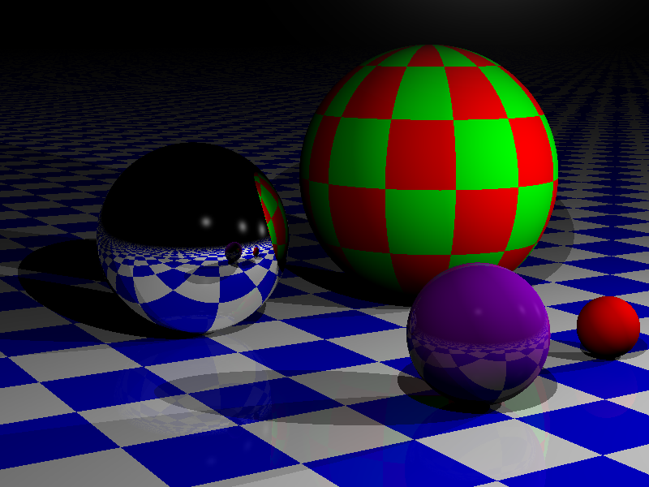

#Projet IN204 - Lancer de rayons
####Par Marie Kalouguine et Davy Privat-Simeu

##Description du projet
blablabla

##Utilisation du code pour synthétiser des images

Le projet a été réalisé sous une distribution Linux et pour Linux, il est donc recommandé d'en être équipé. La compilation nécessite la version C++11 du compilateur.

Pour compiler le projet, il suffit d'entrer la commande `make` dans la ligne de commande.
Cela crée un fichier exécutable `raytracing`, qui permet d'analyser le fichier de description de scènes `scene.xml `(se trouvant dans le même répertoire), et synthétiser une image correspondante par lancer de rayons.

Pour tester le programme, modifiez le fichier XML à vos besoins, puis lancez la commande `./raytracing`

####Description de scènes avec XML
blablabla

##Structure du projet
blablabla

##Améliorations possibles
blablabla