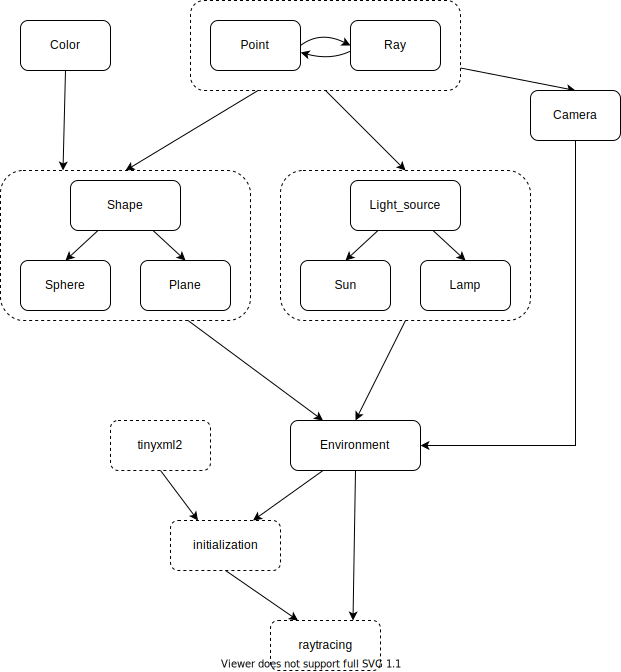

#Projet IN204 - Lancer de rayons

####Par Marie Kalouguine et Davy Privat-Simeu


##Description du projet
blablabla

##Utilisation du code pour synthétiser des images
####Consignes utilisateur

Le projet a été réalisé sous une distribution Linux et pour Linux, il est donc recommandé d'en être équipé. La compilation nécessite la version C++11 du compilateur.

Pour compiler le projet, il suffit d'entrer la commande `make` dans la ligne de commande.
Cela crée un fichier exécutable `raytracing`, qui permet d'analyser le fichier de description de scènes `scene.xml`(se trouvant dans le même répertoire), et synthétiser une image correspondante par lancer de rayons.

Pour tester le programme, modifiez le fichier XML à vos besoins, puis lancez la commande `./raytracing`

####Description de scènes avec XML
La description d'une scène se fait à l'aide de balises dans le fichier `scene.xml`, dans un langagé basé sur XML. La scène s'apparente ainsi à une structure d'arbre. La lecture du fichier se fait grâce à la bibliothèque tinyXML2, donc le code source a été inclus dans le dossier src.

À la racine de l'arbre se trouve la balise <world\>, dans laquelle on place les différents objets composant la scène. Parmi eux, il y a la balise caméra <camera\>, l'ensemble des éclairages <lights\>, ainsi que l'ensemble des objets à représenter <shapes\>.

Une caméra <camera\> est définie par le point duquel on regarde (origin), ainsi qu'un autre point indiquant la direction. Ce deuxième point est dans le plan de projection de la caméra, et l'angle de vue est déterminé par la taille de l'image finale en pixels (pxwidth et pxheight) ainsi que la largeur "réelle" du plan de projection (width). Sa hauteur n'est pas renseignée mais calculée automatiquement, afin d'éviter d'étirer l'image par inadvertence. La modification de pxwidth et pxheight infue autant sur l'angle vertical que sur la résolution de l'image (et donc la longueur de l'execution).

> La rotation de la caméra autour de cet axe est négligée, on considère que le bord bas du plan de projection est toujours horizontal.

À l'intérieur de la balise <lights\>, on peu placer autant de sources de lumière que souhaité, de type <sun\> (source à l'infini) ou de type <lamp\> (source ponctuelle). Chaque source lumineuse doit impérativement être dotée de sa position ainsi que de son intensité (attribut brightness).

À l'intérieur de la balise <shapes\>, on peu placer autant d'objets que souhaité, de type <sphere\> (sphère) ou de type <plane\> (plan infini). Tout objet est muni d'une couleur (attribut color), d'une réflexivité (attribut gloss). Un attribut supplémentaire chess peut être ajouté pour décorer la surface de l'objet avec un échiquier. La valeur de l'attribut doit valoir la couleur de l'échiquier à apposer. La valeur "default" lui donne la couleur opposée à celle de l'objet (un objet bleu obtient alors un échiquier orange).

Les couleurs pouvant être utilisées sont :  
red, green, blue, white, black, grey, yellow, cyan, orange, purple, pink, brown

Voici par exemple le fichier XML qui a servi à synthétiser l'image en tête du présent document :
```
<world>
	<camera pxwidth="2000" pxheight="500" width="3.3">
		<origin x="1" y="0" z="3"/>
		<target x="4" y="5" z="2"/>
	</camera>
	<lights>
		<lamp brightness="1.5">
			<point x="5" y="5" z="4"/>
		</lamp>
		<lamp brightness="1.5">
			<point x="10" y="5" z="3"/>
		</lamp>
		<lamp brightness="1.5">
			<point x="13" y="7" z="2"/>
		</lamp>
	</lights>
	<shapes>
		<sphere color="red" gloss="0" size="1.5" chess="green">
			<point x="9" y="11" z="1.5"/>
		</sphere>
		<sphere color="grey" gloss="1" size="1">
			<point x="6" y="11" z="1"/>
		</sphere>
		<sphere color="red" gloss="0" size="0.3">
			<point x="9" y="8" z="0.3"/>
		</sphere>
		<sphere color="white" gloss="0" size="0.6" chess="default">
			<point x="7" y="7.5" z="0.6"/>
		</sphere>
		
		<plane color="blue" gloss="0.1" chess="white">
			<origin x="0" y="0" z="0"/>
			<normal x="0" y="0" z="1"/>
		</plane>
		<plane color="white" gloss="0">
			<origin x="20" y="20" z="0"/>
			<normal x="-3" y="-1" z="0"/>
		</plane>
		<plane color="white" gloss="0">
			<origin x="20" y="20" z="0"/>
			<normal x="1" y="-3" z="0"/>
		</plane>
		<plane color="white" gloss="0">
			<origin x="-20" y="-20" z="0"/>
			<normal x="3" y="1" z="0"/>
		</plane>
		<plane color="white" gloss="0">
			<origin x="-20" y="-20" z="0"/>
			<normal x="-1" y="3" z="0"/>
		</plane>
		<plane color="white" gloss="0">
			<origin x="0" y="0" z="50"/>
			<normal x="0" y="0" z="-1"/>
		</plane>
	</shapes>
</world>
```

> **Attention :**  Le code permettant de lire le fichier xml ne contient pas encore de vérification quant au respect de la syntaxe.  
Un fichier mal écrit a de fortes chances de mener à une *Segmentation Fault*.

##Structure du projet

Le projet est séparé en plusieurs fichiers source, tous regroupés dans le dossier **src**. Le dossier **test** contient des tests unitaires qui ont été utilisés pour développer la syntaxe xml ainsi que la souvegarde d'une image au format .ppm depuis un tableau de couleurs rgb.

Les fichiers sources vont tous par paires, un fichier source c++ (extension .cpp) et son header (extension .hpp). La seule exception est le fichier raytracing.cpp, qui contient la fonction main(). Chaque paire correspond la plupart du temps à une ou plusieurs classes, ainsi les méthodes de classe correspondantes.  
Le fichier initialization.cpp (et son header correspondant) n'implémente pas une classe, mais la fonction permettant d'initialiser la scène en lisant le fichier xml.

Lors de la compilation séparée, les fichiers objets créés sont stockés dans un dossier **./obj** créé à l'occasion.

**Dependance des classes :**



**Description des classes :**


##Améliorations possibles
blablabla